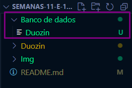
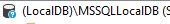
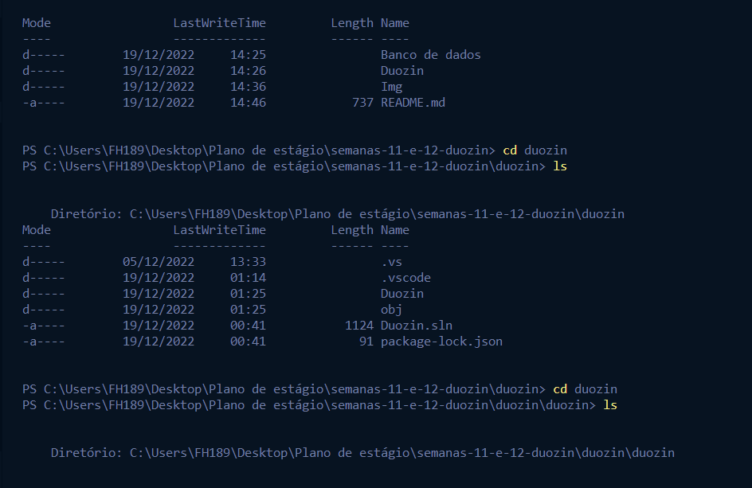
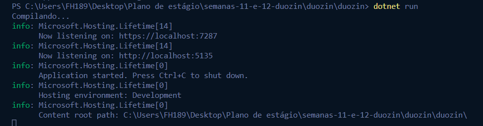
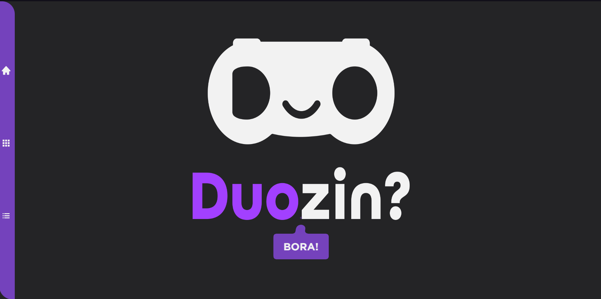
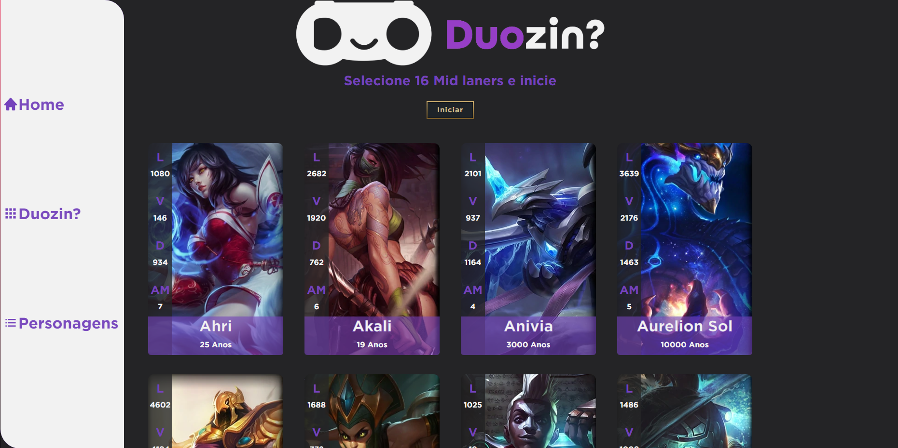
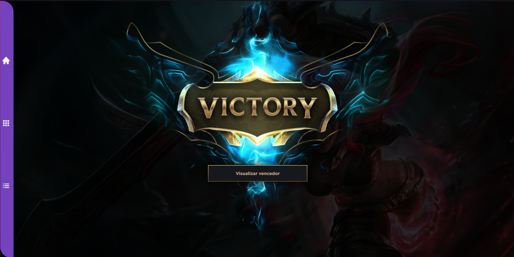
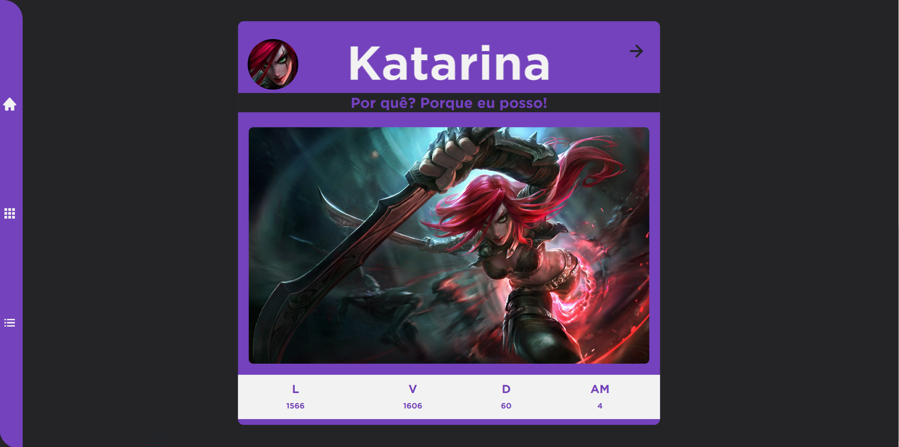
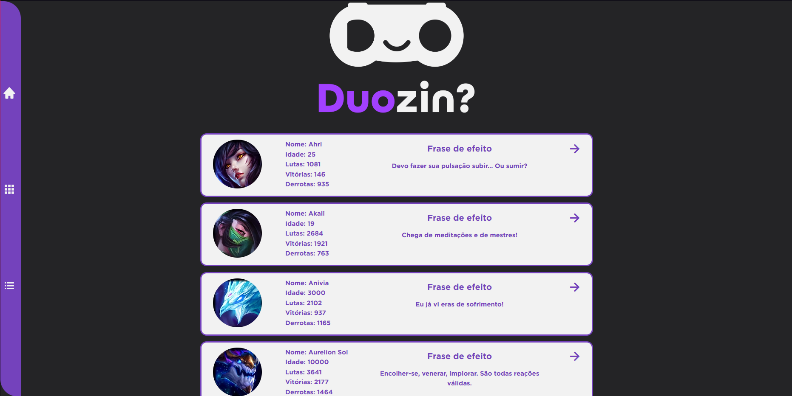

# 👾 Projeto semana 11 e 12 - Duozin 👾 #
## 1 - Preparando o DB 💾
#
###  Para iniciar o projeto você vai precisar importar no localdb o arquivo 'Duozin.bak' presente na pasta 'Banco de dados'

Quando configurar o LocalDB certifique-se de que está nessa instância ou mude no código a instância desejada

🎥 [Importando o banco de dados](https://www.youtube.com/watch?v=dCSkov0OfHM)
#

## 2 - Executando o projeto 💡

#
### O projeto foi feito utilizando .NET 6 então certifique-se de utilizar o VSCode ou o Visual Studio 2022 ou posterior(Não funcionará no 2019 ou anteriores).🤬
#

### (No VSCode) Navegue até a pasta onde se encontra a o arquivo startup.cs e então digite "dotnet run" no terminal como mostro no exemplo abaixo.🤡

### Após isso segure ctrl e clique com o botão esquerdo no link "https://localhost:7287" ou o que aparecer para você

#

## 3 - Utilizando 🌠

#

### Siga as instruções do app e o caminho feliz ocorrerá.
#
### Tela inicial 🥶

### Tela do torneio 😱

### Tela do vencedor 😱
 

### Tela de listagem dos personagens

#

## 4 - Considerações 🤠

#

### Caso você esteja tendo algum problema de exceptios certifique-se de que importou o banco corretamente, caso tenha importado veja se o javascript do seu navegador está ativo e limpe o cache do mesmo.😶

### As tecnologias utilizadas no projeto foram:
- C#
- .NET 6
- ASP NET MVC
- Javascript
- Bootstrap 
- SASS
- Boxicons

### Caso tenha alguma dúvida pode me contatar.

